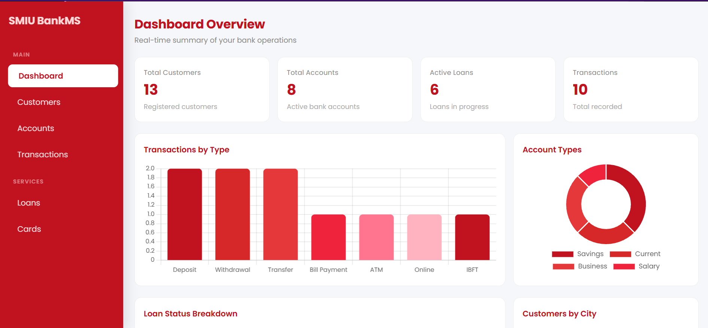
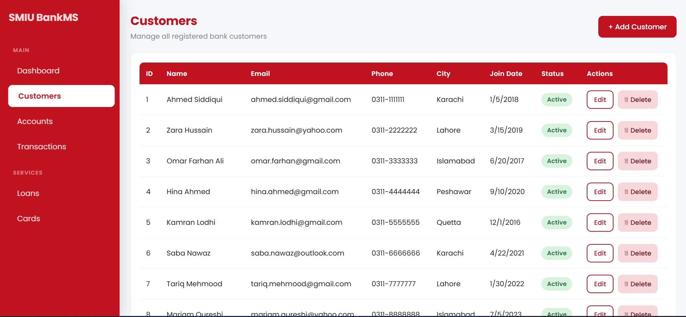
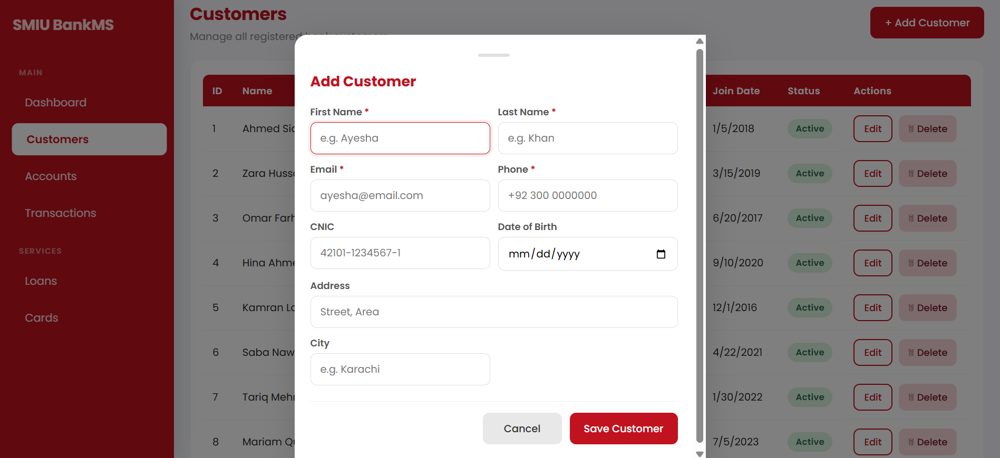
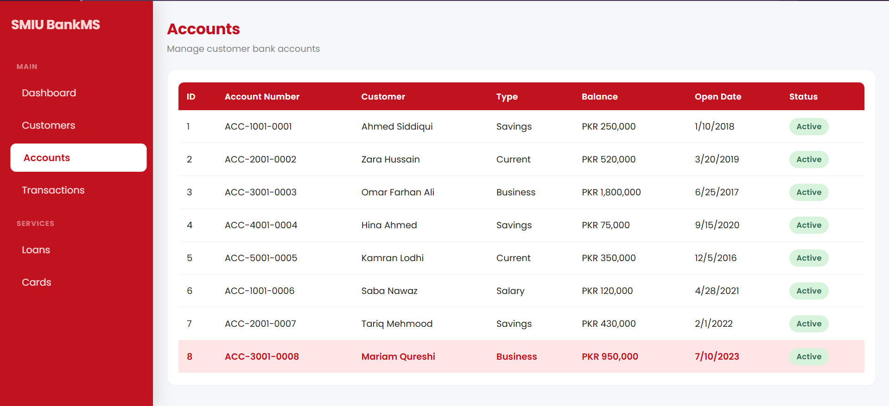
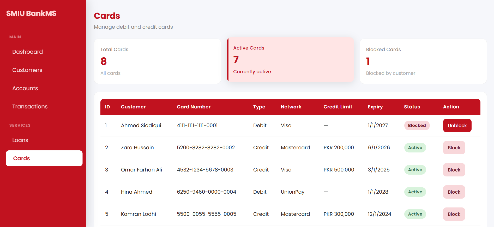
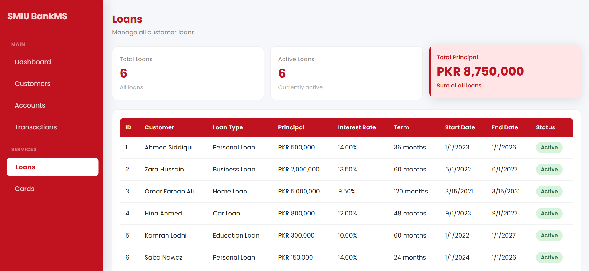
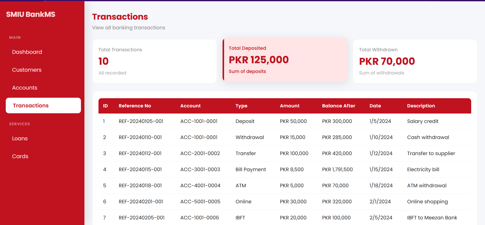

# Bank_Management_System
A full-stack Bank Management System built using Node.js, Express, and PostgreSQL with a modern frontend using HTML, CSS, JavaScript, and Chart.js.

It provides a complete dashboard for managing banking operations like customers, accounts, transactions, loans, and cards.

## Dashboard
Real-time statistics (Customers, Accounts, Loans, Transactions)
Interactive charts using Chart.js:
Transactions by Type
Account Types
Loan Status Breakdown
Customers by City

## Customers Module
Add / Edit / Delete customers
View customer details
Status management (Active, Inactive, Blocked)

## Accounts Module
Manage bank accounts
View account types and balances

## Transactions Module
View recent transactions
Track deposits and withdrawals

## Loans Module
Track active and closed loans
Loan status visualization

## Tech Stack
### Frontend
1. HTML5
2. CSS3
3. JavaScript (ES6 Modules)
4. Chart.js

### Backend
1. Node.js
2. Express.js

### Database
1. PostgreSQL

## Developer
Built by a BSIT student Beshair Khan as a university project.

## Project Structure

```bash
bank_management_system/
├── backend/
│   ├── .env                         ← Contains Neon connection snippet and port.
│   ├── .env.example                 ← empty template, safe to commit
│   ├── .gitignore                   ← addeed node_modules and .env here
│   ├── package.json
│   ├── package-lock.json
│   ├── server.js
│   ├── node_modules/
│   └── src/
│       ├── app.js
│       ├── config/
│       │   └── db.js
│       ├── controllers/
│       │   ├── accounts.controller.js
│       │   ├── cards.controller.js
│       │   ├── customers.controller.js
│       │   ├── loans.controller.js
│       │   └── transactions.controller.js
│       ├── middleware/
│       │   ├── errorHandler.js
│       │   └── validateId.js
│       └── routes/
│           ├── accounts.js
│           ├── branches.js
│           ├── cards.js
│           ├── customers.js
│           ├── employees.js
│           ├── loans.js
│           ├── notifications.js
│           └── transactions.js
│
├── frontend/
│   ├── pages/
│   │   ├── index.html
│   │   ├── accounts.html
│   │   ├── cards.html
│   │   ├── customers.html
│   │   ├── loans.html
│   │   └── transactions.html
│   ├── css/
│   │   ├── style.css
│   │   └── dashboard.css
│   └── js/
│       ├── api.js
│       ├── customers.js
│       ├── dashboard.js
│       └── transactions.js
│
├── database/
│   └── schema.sql
│
├── .gitignore
└── README.md
```

## Installation/Setup
### Clone The Repository
```bash
git clone <your-repo-link>
cd bank_management_system
```
### Install Dependencies For Backend
```bash
cd backend
npm install
```
Backend Libraries Used
1. express
2. pg
3. dotenv
4. cors
5. nodemon (dev dependency)
### Create Enviroment File
```bash
Inside backend creae a .env file
PORT=3000
DATABASE_URL=your_postgres_connection_string 
``` 
### Run Backend Server
npm run dev

## Screenshots

### Dashboard



### Customers Page



### Accounts Page


### Cards Page


### Loan Page


### Transactions Page

